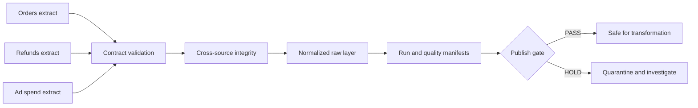

# Analytics Automation Platform

A reliability-first analytics platform that decides whether daily executive KPIs are safe to publish before a dashboard refresh.

> Portfolio demonstration using deterministic synthetic data only. No employer, customer, or private operational data is included.

## Business question

Can an analytics lead prove that revenue, refund, and marketing inputs are complete, fresh, and contract-compliant before executives act on the resulting KPIs?

The decision owner is a BI or analytics engineering lead responsible for trustworthy daily reporting. Instead of silently refreshing a broken dashboard, the platform produces an auditable publish-or-hold decision.

## Day 1 build status

The ingestion foundation currently:

- loads three deterministic source-system extracts;
- applies versioned JSON data contracts;
- validates column presence, types, primary keys, accepted values, and numeric bounds;
- checks source freshness against a fixed fixture timestamp;
- verifies the refund-to-order relationship across sources;
- writes normalized raw-layer outputs only after validation succeeds;
- records SHA-256 lineage, row counts, freshness, and check results in a run manifest; and
- reproduces committed outputs byte for byte with automated tests.

## Quick start

```bash
make test
make run
```

Generated outputs are written to `artifacts/`:

- `raw/*.csv` — contract-validated source snapshots;
- `ingestion_manifest.json` — run identity, lineage hashes, row counts, freshness, and publish gate; and
- `quality_report.json` — check-level evidence for every source and relationship.

The project uses only the Python standard library, so Day 1 has no dependency installation step.

## Decision flow



## Five-day roadmap

1. **Reliable ingestion:** deterministic fixtures, source registry, data contracts, quality gate — complete
2. **Governed metrics:** transformation layer, metric contracts, reconciliation tests
3. **Orchestration:** dependency graph, retries, run history, SLA and observability checks
4. **AI operations:** incident summaries, human-review policy, evaluation and modeled cost tracking
5. **Decision experience:** executive dashboard, CI, GitHub Pages, profile refresh, interview walkthrough

## Repository map

```text
src/analytics_automation_platform/  contracts, validation, ingestion, and pipeline entry point
config/                             source registry and versioned data contracts
data/source/                        deterministic synthetic source extracts
tests/                              contract, freshness, lineage, and reproducibility tests
artifacts/raw/                      validated source snapshots
artifacts/                          run manifest and check-level quality evidence
docs/                               architecture and data-contract decisions
```

## AI-augmented build method

I use AI as an engineering multiplier for implementation, edge-case generation, and documentation. I own the business framing, contracts, architecture, evaluation criteria, tests, and every published decision. Generated work is accepted only after it runs, survives tests, and can be explained.

## Current limitations

- Source extracts are local CSV fixtures rather than live warehouse, SaaS, or object-storage connections.
- The fixture timestamp is fixed so the repository remains deterministic; production freshness would use the orchestrator's scheduled timestamp.
- The current gate stops the run on invalid input. Quarantine routing and retry behavior arrive with orchestration on Day 3.
- Day 1 proves input trust only. KPI transformation and reconciliation arrive on Day 2.

## License

MIT

