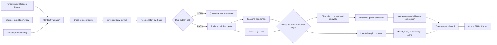

# Revenue Forecasting Control Tower

A reliability-first analytics platform for forecasting revenue from seasonality, marketing investment, affiliate activity, sales, and shipment trends.

[**Open the executive dashboard →**](https://pratyushdhakad.github.io/analytics-automation-platform/)

New to Git or GitHub? Read the [step-by-step beginner build journal](docs/beginner-build-journal.md) to see how the project moved from an empty repository to tested code, CI, GitHub Pages, and forecast monitoring.

> Portfolio demonstration using deterministic synthetic data only. No employer, customer, or private operational data is included.

## Business question

What revenue should leadership expect over the next 4, 8, and 13 weeks—and how could marketing plans, affiliate activity, promotions, and fulfillment constraints change the outcome?

The decision owner is a revenue, marketing, or analytics leader who needs an explainable forecast and an auditable publish-or-hold decision before committing budget or operating capacity.

## Build status

The forecast-ready data foundation currently:

- generates 1,096 days of deterministic synthetic revenue history;
- models annual and weekday seasonality, commercial events, growth, refunds, stockout pressure, and fulfillment backlog;
- captures daily spend for paid search, paid social, retargeting, and email;
- captures partner-level affiliate clicks, orders, revenue, and commissions;
- separates booked net revenue from shipped revenue and backlog release;
- publishes a governed daily metric mart with BigQuery-compatible SQL;
- applies versioned JSON data contracts;
- validates column presence, types, primary keys, accepted values, and numeric bounds;
- checks source freshness against a fixed fixture timestamp;
- verifies cross-source date and refund relationships;
- writes normalized raw-layer outputs only after validation succeeds;
- records SHA-256 lineage, row counts, freshness, and check results in a run manifest;
- reconciles revenue, channel spend, affiliates, and shipment-gap arithmetic;
- compares a 52-week seasonal benchmark with a ridge-regularized driver model;
- runs six leakage-safe rolling forecast origins across 4-, 8-, and 13-week windows;
- reports WAPE, MASE, bias, RMSE, MAE, and 90% interval coverage;
- selects a separate out-of-sample champion for net and shipped revenue;
- publishes a 91-day conditional forecast with explicit driver assumptions;
- compares seven versioned growth and fulfillment scenarios;
- retains channel-level paid search, paid social, retargeting, and email plans;
- layers driver-model sensitivities onto the best-tested baseline for each target;
- separates booked-demand changes from fulfillment-capacity effects;
- generates an interactive executive dashboard from the tested evidence contract;
- monitors the latest out-of-sample champion forecasts across 4-, 8-, and 13-week windows;
- evaluates forecast WAPE, signed bias, and interval coverage against versioned health thresholds;
- publishes deterministic HEALTHY, WATCH, or CRITICAL alerts with an explicit operator response;
- enforces tests, pipeline reproduction, artifact freshness, and JavaScript validation in CI;
- deploys the static dashboard through GitHub Pages; and
- reproduces generated history, evaluation, forecasts, scenarios, and dashboard data byte for byte.

## Latest model decision

| Target | Champion | 91-day WAPE | Bias | Interval coverage |
|---|---|---:|---:|---:|
| Net revenue | Driver regression | 1.68% | +0.67% | 93.41% |
| Shipped revenue | Seasonal naive | 9.60% | -9.40% | 93.22% |

The split decision is the point: complexity must earn promotion. Marketing, affiliate, calendar, and stockout signals improve net-revenue forecasting, but do not outperform the seasonal benchmark for shipment timing.

## Latest monitoring decision

| Target | Status | 91-day WAPE | Bias | Interval coverage |
|---|---|---:|---:|---:|
| Net revenue | HEALTHY | 1.53% | +0.67% | 96.70% |
| Shipped revenue | WATCH | 8.83% | -8.44% | 95.60% |

The overall status is **WATCH** because the latest shipment holdout systematically under-predicts actuals. The generated alert routes an analyst to review plan, backlog, and capacity assumptions before the next refresh. This is a deterministic replay of out-of-sample evidence—not a claim of live production monitoring.

## 13-week scenario decision

| Scenario | Net revenue | Delta vs base | Shipped revenue | Shipment delta |
|---|---:|---:|---:|---:|
| Upside | $955,855 | +$77,993 | $875,100 | +$70,684 |
| Marketing acceleration | $943,737 | +$65,875 | $838,015 | +$33,599 |
| Affiliate expansion | $921,997 | +$44,135 | $844,830 | +$40,414 |
| Base plan | $877,862 | — | $804,416 | — |
| Capacity relief | $877,862 | $0 | $840,240 | +$35,824 |
| Downside | $808,125 | -$69,738 | $719,717 | -$84,699 |

These are conditional planning sensitivities, not causal lift or ROAS estimates. The champion forecast remains the baseline; scenarios add only the fitted driver-model delta. Capacity changes shipment realization without changing booked net revenue.

## Quick start

```bash
make test
make run
```

Then serve the dashboard locally:

```bash
python3 -m http.server 8765 --directory site
```

Generated outputs are written to `artifacts/`:

- `raw/*.csv` — contract-validated source snapshots;
- `ingestion_manifest.json` — run identity, lineage hashes, row counts, freshness, and publish gate;
- `quality_report.json` — check-level evidence for every source and relationship;
- `marts/daily_revenue_metrics.csv` — 1,096 forecast-ready daily observations;
- `metric_summary.json` — latest 28-day decision metrics;
- `metric_quality_report.json` — metric reconciliation evidence;
- `forecast_backtest.csv` — 2,184 out-of-sample predictions and errors;
- `forecast_evaluation.json` — 4-, 8-, and 13-week scorecards and champions;
- `forecast_driver_plan.csv` — explicit future marketing, affiliate, event, and stockout assumptions;
- `revenue_forecast.csv` — 91 daily forecasts per target with 90% intervals; and
- `forecast_summary.json` — executive horizon totals and prior-period comparisons;
- `forecast_monitoring.json` — latest-origin health status, thresholds, target scorecards, and alerts;
- `forecast_alerts.csv` — operator-ready threshold breaches and response messages;
- `scenario_forecasts.csv` — 1,274 daily scenario-target forecasts;
- `scenario_ranking.csv` — ranked 13-week plan comparison; and
- `scenario_summary.json` — 4-, 8-, and 13-week scenario scorecards and assumptions.

The project uses only the Python standard library, so the deterministic pipeline has no dependency installation step.

The generated dashboard contract is written to `site/data/dashboard.json`. The public site uses plain HTML, CSS, and JavaScript with no external chart or runtime dependencies.

## Decision flow



## Six-day build progression

1. **Reliable ingestion:** deterministic fixtures, source registry, data contracts, quality gate — complete
2. **Revenue data foundation:** three-year seasonal history, marketing and affiliate drivers, sales-to-shipment trends, governed metrics — complete
3. **Forecasting engine:** seasonal baselines, external-regressor models, rolling-origin backtests, accuracy, bias, and prediction intervals — complete
4. **Growth scenarios:** planned channel spend, affiliate, promotion, and fulfillment-capacity scenarios — complete
5. **Decision experience:** executive forecast dashboard, CI, GitHub Pages, profile refresh, interview walkthrough — complete
6. **Forecast operations:** latest-origin health checks, threshold alerts, monitoring evidence, dashboard feedback loop — complete

## Repository map

```text
src/analytics_automation_platform/  history, contracts, metrics, forecasting, scenarios, monitoring, dashboard, pipeline
config/                             source, metric, forecast, scenario, and monitoring contracts
data/source/                        deterministic revenue, marketing, affiliate, and Day 1 fixtures
sql/                                BigQuery reference transformation
tests/                              contract, leakage, evaluation, scenario, monitoring, dashboard, lineage, and reproducibility tests
artifacts/raw/                      validated source snapshots
artifacts/marts/                    forecast-ready daily metric mart
artifacts/                          quality, backtest, evaluation, forecast, and summary evidence
site/                               dependency-free interactive executive dashboard and generated data contract
.github/workflows/                  continuous integration and GitHub Pages deployment
docs/                               architecture, modeling, scenarios, monitoring, deployment, and interview walkthrough
```

## AI-augmented build method

I use AI as an engineering multiplier for implementation, edge-case generation, and documentation. I own the business framing, contracts, architecture, evaluation criteria, tests, and every published decision. Generated work is accepted only after it runs, survives tests, and can be explained.

## Current limitations

- Source extracts are deterministic synthetic fixtures rather than live warehouse, advertising, affiliate, or fulfillment systems.
- The fixture timestamp is fixed so the repository remains deterministic; production freshness would use the orchestrator's scheduled timestamp.
- Marketing efficiency and attributed orders are predictive planning signals, not causal incrementality or ROAS claims.
- Driver-model backtests use realized drivers as a proxy for the plan available at each origin; production should retain point-in-time plan snapshots.
- Prediction intervals are empirical and the summed daily bounds are not joint period intervals.
- The forecast uses aggregate marketing spend; channel plans reconcile individually but do not claim channel-specific causal response curves.
- Fulfillment scenarios use an explainable demand-gap heuristic rather than an inventory or warehouse network simulation.
- Synthetic seasonality and driver relationships prove engineering behavior, not real-world forecast accuracy.
- Scenarios are deterministic plan sensitivities; a production workflow would add plan ownership, approvals, and observed-versus-plan variance.
- Monitoring replays the latest rolling-origin champion holdout; production would compare immutable forecast vintages with newly landed actuals on a schedule.
- Thresholds are portfolio demonstration defaults and would require business-specific service levels and escalation ownership.
- The public dashboard is static and intentionally contains no authentication or operational write controls.

See [the revenue data foundation](docs/revenue-data-foundation.md) for signal design, [forecasting and evaluation](docs/forecasting-and-evaluation.md) for leakage controls and scorecards, [growth scenario analysis](docs/scenario-analysis.md) for decision boundaries, [forecast monitoring](docs/forecast-monitoring.md) for thresholds and response rules, [deployment](docs/deployment.md) for CI and Pages, and the [interview walkthrough](docs/interview-walkthrough.md) for the concise project story.

## License

MIT
