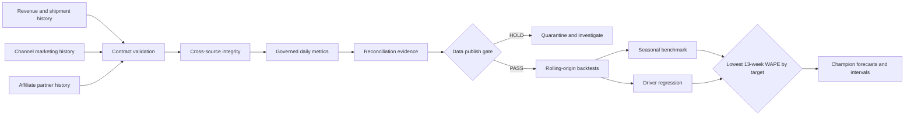

# Revenue Forecasting Control Tower

A reliability-first analytics platform for forecasting revenue from seasonality, marketing investment, affiliate activity, sales, and shipment trends.

> Portfolio demonstration using deterministic synthetic data only. No employer, customer, or private operational data is included.

## Business question

What revenue should leadership expect over the next 4, 8, and 13 weeks—and how could marketing plans, affiliate activity, promotions, and fulfillment constraints change the outcome?

The decision owner is a revenue, marketing, or analytics leader who needs an explainable forecast and an auditable publish-or-hold decision before committing budget or operating capacity.

## Day 3 build status

The forecast-ready data foundation currently:

- generates 1,096 days of deterministic synthetic revenue history;
- models annual and weekday seasonality, commercial events, growth, refunds, stockout pressure, and fulfillment backlog;
- captures daily spend for paid search, paid social, retargeting, and email;
- captures partner-level affiliate clicks, orders, revenue, and commissions;
- separates booked net revenue from shipped revenue and backlog release;
- publishes a governed daily metric mart with BigQuery-compatible SQL;
- applies versioned JSON data contracts;
- validates column presence, types, primary keys, accepted values, and numeric bounds;
- checks source freshness against a fixed fixture timestamp;
- verifies cross-source date and refund relationships;
- writes normalized raw-layer outputs only after validation succeeds;
- records SHA-256 lineage, row counts, freshness, and check results in a run manifest;
- reconciles revenue, channel spend, affiliates, and shipment-gap arithmetic; and
- compares a 52-week seasonal benchmark with a ridge-regularized driver model;
- runs six leakage-safe rolling forecast origins across 4-, 8-, and 13-week windows;
- reports WAPE, MASE, bias, RMSE, MAE, and 90% interval coverage;
- selects a separate out-of-sample champion for net and shipped revenue;
- publishes a 91-day conditional forecast with explicit driver assumptions; and
- reproduces generated history, evaluation, and forecasts byte for byte with automated tests.

## Latest model decision

| Target | Champion | 91-day WAPE | Bias | Interval coverage |
|---|---|---:|---:|---:|
| Net revenue | Driver regression | 1.68% | +0.67% | 93.41% |
| Shipped revenue | Seasonal naive | 9.60% | -9.40% | 93.22% |

The split decision is the point: complexity must earn promotion. Marketing, affiliate, calendar, and stockout signals improve net-revenue forecasting, but do not outperform the seasonal benchmark for shipment timing.

## Quick start

```bash
make test
make run
```

Generated outputs are written to `artifacts/`:

- `raw/*.csv` — contract-validated source snapshots;
- `ingestion_manifest.json` — run identity, lineage hashes, row counts, freshness, and publish gate;
- `quality_report.json` — check-level evidence for every source and relationship;
- `marts/daily_revenue_metrics.csv` — 1,096 forecast-ready daily observations;
- `metric_summary.json` — latest 28-day decision metrics;
- `metric_quality_report.json` — metric reconciliation evidence;
- `forecast_backtest.csv` — 2,184 out-of-sample predictions and errors;
- `forecast_evaluation.json` — 4-, 8-, and 13-week scorecards and champions;
- `forecast_driver_plan.csv` — explicit future marketing, affiliate, event, and stockout assumptions;
- `revenue_forecast.csv` — 91 daily forecasts per target with 90% intervals; and
- `forecast_summary.json` — executive horizon totals and prior-period comparisons.

The project uses only the Python standard library, so the deterministic pipeline has no dependency installation step.

## Decision flow



## Five-day roadmap

1. **Reliable ingestion:** deterministic fixtures, source registry, data contracts, quality gate — complete
2. **Revenue data foundation:** three-year seasonal history, marketing and affiliate drivers, sales-to-shipment trends, governed metrics — complete
3. **Forecasting engine:** seasonal baselines, external-regressor models, rolling-origin backtests, accuracy, bias, and prediction intervals — complete
4. **Growth scenarios:** planned channel spend, affiliate, promotion, and fulfillment-capacity scenarios
5. **Decision experience:** executive forecast dashboard, CI, GitHub Pages, profile refresh, interview walkthrough

## Repository map

```text
src/analytics_automation_platform/  history, contracts, ingestion, metrics, forecasting, evaluation, pipeline
config/                             source, metric, and forecast contracts
data/source/                        deterministic revenue, marketing, affiliate, and Day 1 fixtures
sql/                                BigQuery reference transformation
tests/                              contract, signal, reconciliation, leakage, evaluation, lineage, and reproducibility tests
artifacts/raw/                      validated source snapshots
artifacts/marts/                    forecast-ready daily metric mart
artifacts/                          quality, backtest, evaluation, forecast, and summary evidence
docs/                               architecture, revenue-foundation, and forecasting decisions
```

## AI-augmented build method

I use AI as an engineering multiplier for implementation, edge-case generation, and documentation. I own the business framing, contracts, architecture, evaluation criteria, tests, and every published decision. Generated work is accepted only after it runs, survives tests, and can be explained.

## Current limitations

- Source extracts are deterministic synthetic fixtures rather than live warehouse, advertising, affiliate, or fulfillment systems.
- The fixture timestamp is fixed so the repository remains deterministic; production freshness would use the orchestrator's scheduled timestamp.
- Marketing efficiency and attributed orders are predictive planning signals, not causal incrementality or ROAS claims.
- Driver-model backtests use realized drivers as a proxy for the plan available at each origin; production should retain point-in-time plan snapshots.
- Prediction intervals are empirical and the summed daily bounds are not joint period intervals.
- Synthetic seasonality and driver relationships prove engineering behavior, not real-world forecast accuracy.
- Day 3 forecasts are conditional on one explicit driver plan; adjustable scenarios arrive on Day 4.

See [the revenue data foundation](docs/revenue-data-foundation.md) for signal design and governed definitions, and [forecasting and evaluation](docs/forecasting-and-evaluation.md) for leakage controls, scorecards, and modeling limitations.

## License

MIT
